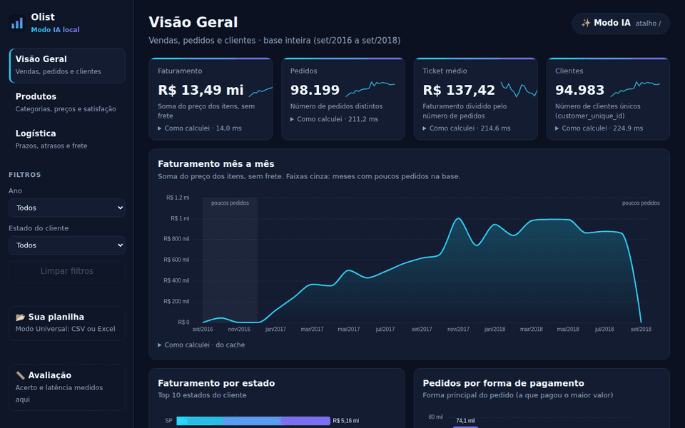
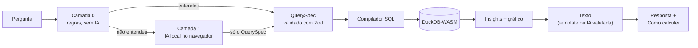

# olist-modo-ia

**Dashboard de vendas com IA que roda 100% no navegador.** Você pergunta em português ("top 5 categorias em 2018",
"e só em SP?") e recebe o gráfico, o texto e o **"Como calculei"**: o SQL e o tempo de cada consulta. O banco
(DuckDB) e a IA (WebLLM) rodam no seu computador: **nenhum dado sai dele**, e um contador na tela prova isso.
Funciona com a base pública da Olist e com **qualquer planilha CSV/Excel** que você arrastar.

🔗 **[olist-modo-ia.vercel.app](https://olist-modo-ia.vercel.app)** · [avaliação ao vivo](https://olist-modo-ia.vercel.app/avaliacao) ·
[sua planilha](https://olist-modo-ia.vercel.app/planilha)



## O problema

"Converse com seus dados" costuma significar mandar a planilha da empresa para um servidor e confiar num modelo
que às vezes inventa números. Este projeto responde às 4 dúvidas que sempre aparecem:

| Dúvida | Resposta aqui | Prova |
|---|---|---|
| A IA inventa números? | Ela **nunca calcula nem escreve SQL**. Só preenche um formulário (QuerySpec) validado com Zod; o DuckDB calcula; um validador recusa texto com número que não veio do banco. | testes do validador + [`/avaliacao`](https://olist-modo-ia.vercel.app/avaliacao) |
| Tem tráfego escondido? | CSP no cabeçalho HTTP + Service Worker "firewall" que conta (e, no modo local, bloqueia) toda requisição externa, inclusive dos workers. | contador "0" na tela, `privacidade.spec.ts` |
| O que fica salvo? | Só neste navegador; botão "Apagar dados locais" diz quanto apagou. | [`docs/PRIVACIDADE.md`](docs/PRIVACIDADE.md) |
| E dados sensíveis (RH, saúde)? | Dado pessoal sai mascarado; grupos com menos de 5 registros somem de tudo (regra no compilador SQL). | `universal.spec.ts`, `temas.spec.ts` |

## O que ele faz

- **Dashboard da Olist** (3 páginas, filtros, KPIs com minissérie). Os totais batem com o Power BI no centavo:
  R$ 13.494.400,74 · 98.199 pedidos · ticket R$ 137,42 ([`dados/validacao.md`](dados/validacao.md)).
- **✨ Modo IA em duas camadas:**
  - **Modo Rápido (regras):** responde a maioria das perguntas em milissegundos, sem modelo nenhum.
  - **IA local (WebLLM + WebGPU):** entra só quando as regras não entendem.
  - **Explica sem inventar:** follow-ups ("e só em SP?"), "por que caiu?" (mostra ONDE mudou, nunca inventa a
    causa), fora de escopo ("não tenho lucro na base") e perguntas de volta com chips.
- **Modo Universal:** arraste um CSV/Excel.
  - O app detecta codificação, separador, cabeçalho, linhas de total e o tipo de cada coluna (inclusive CPF,
    e-mail e telefone, que saem mascarados).
  - Reconhece o **tema** sem IA (vendas, financeiro, RH, estoque, marketing, atendimento, educação, saúde) e
    monta o dashboard daquele tema.
  - Faz 2 ou 3 perguntas rápidas (objetivo, quem vai ver, coluna que faltou).
- **Avaliação ao vivo:** a página `/avaliacao` roda 102 perguntas no seu navegador e mostra acerto por categoria,
  metas e latência.

## Números

Medidos, não estimados. Quando uma meta não foi cumprida, está escrito. Detalhes: [`docs/BENCHMARK.md`](docs/BENCHMARK.md).

| O quê | Resultado | Meta |
|---|---:|---:|
| Perguntas da suíte respondidas certo, sem IA (102, 7 categorias) | 102/102 | ≥ 75% |
| **Lote cego** (26 perguntas escritas antes de rodar), 1ª rodada | **21/26 (80,8%)** | — |
| Fora de escopo recusadas corretamente | 11/11 | 100% |
| Modo Rápido ponta a ponta no navegador (p50 / p95) | 22 / 88 ms | < 300 ms |
| Tipo das colunas das planilhas de teste, sem ajuste | 88/88 | ≥ 90% |
| Tema da planilha sem IA, 1ª rodada | 24/25 (96%) | ≥ 90% |
| Primeira pintura | 0,28 s | < 2 s |
| Dashboard completo, 1ª visita (máquina de nuvem, sem GPU) | 3,0 s | — |
| Acessibilidade (axe-core, WCAG 2.1 A/AA, 8 telas) | 0 violações | 0 |
| Requisições externas no modo local | 0 | 0 |
| IA real (planejamento com o modelo em cache) | **a medir no PC com GPU** | < 3 s (GPU dedicada) |

## Arquitetura



Mais diagramas (Modo Universal e privacidade) em [`docs/ARQUITETURA.md`](docs/ARQUITETURA.md).
Stack: Vite + React + TypeScript strict, DuckDB-WASM 1.32, WebLLM 0.2.85, ECharts, Zod, SheetJS, Vitest, Playwright.

## Como rodar

### 1. Dados (Python)

Requer Python 3.11+.

```bash
python -m venv .venv
source .venv/bin/activate             # Windows (PowerShell): .venv\Scripts\Activate.ps1
pip install -r scripts/requirements.txt
python scripts/baixar_dados.py        # baixa o que faltar em ./dados e confere o SHA-256 (--verificar só confere)
python scripts/preparar_dados.py      # gera public/data/*.parquet, meta.json e dados/validacao.md
python -m pytest tests/dados -q       # 57 testes
```

O `preparar_dados.py` termina com erro se os totais não baterem com o Power BI (faturamento R$ 13.494.400,74 ·
98.199 pedidos · ticket médio R$ 137,42 · 94.983 clientes únicos).

### 2. Dashboard (Node)

Requer Node 22.12+.

```bash
npm ci
npm run baixar-extensoes      # caminho final: leitor de Parquet servido pelo app (precisa de extensions.duckdb.org uma vez)
npm run dev                   # http://localhost:5173
npm test                      # testes unitários (Vitest) + suíte da Camada 0 (evals/perguntas.json)
npx playwright install chromium && npx playwright test   # e2e no build de produção
```

Sem `npm run baixar-extensoes`, o app usa um arquivo `.duckdb` provisório com os mesmos dados
(`python scripts/gerar_duckdb_provisorio.py`) e avisa no rodapé. Ver `docs/DECISOES.md` (D15 e D17).

### 3. IA local (opcional, WebGPU)

A IA só é baixada quando você clica em **Ativar IA local** no painel ✨ Modo IA (precisa de WebGPU: Chrome/Edge
recentes). Ela só entra quando o Modo Rápido não entende a pergunta; o modelo devolve um QuerySpec (nunca SQL nem
números), e o texto que ele escreve só aparece se passar no validador.

```bash
npm run baixar-modelo -- --so-libs    # model_lib (.wasm) servida pelo próprio site: obrigatório nos dois modos
npm run dev                           # modo demo: pesos do Hugging Face (único domínio externo, explícito na CSP)

npm run baixar-modelo -- --modelo Qwen2.5-1.5B-Instruct-q4f16_1-MLC   # modo local: pesos em public/models
VITE_MODEL_SOURCE=local npm run dev   # nenhum domínio externo (PowerShell: $env:VITE_MODEL_SOURCE="local"; npm run dev)
```

`VITE_MODELO=<model_id>` força um modelo. Detalhes e números: `docs/DECISOES.md` (D28 a D35) e `docs/BENCHMARK.md`.

### 4. Sua planilha (Modo Universal)

Abra `/planilha` (ou "📂 Sua planilha" na barra lateral) e arraste um ou mais CSVs. O app detecta codificação,
separador e cabeçalho, remove linhas vazias e de total, classifica cada coluna (data, dinheiro, %, categoria, UF,
dado pessoal…), mostra a tela **Entendi assim** para revisão e gera o dashboard e o Modo IA sobre a planilha.
Nada é enviado: tudo roda no navegador. Planilhas de teste em `evals/planilhas/` (`npm run gerar-planilhas-teste`).

**Dashboards por tema (Fase 5B):** o app diz de que tema a planilha parece ser, com a confiança e o porquê
("encontrei Pedido, Data do Pedido, Total do Pedido…"). Depois faz 2 ou 3 perguntas opcionais:
- **o objetivo** (ex.: acompanhar faturamento, achar produtos campeões, entender sazonalidade);
- **quem vai ver** (gestor, equipe, cliente);
- **a coluna que faltar** ("Qual coluna é o valor principal?").

O dashboard segue uma receita declarativa do tema. Sem a coluna certa, o painel some e a tela explica por quê;
nenhum número é inventado. A IA local pode sugerir o tema vendo só os nomes e tipos das colunas (opcional).
Exemplos na tela inicial: "Experimente: Vendas, RH, Estoque, Financeiro…" (dados fictícios; `npm run gerar-planilhas-temas`).

### Testes

```bash
npm test                         # Vitest: compilador, roteador, IA com motor falso, Modo Universal, temas, avaliação
npx playwright test              # e2e no build de produção: dashboard, Modo IA, planilhas, privacidade, a11y, SEO
python -m pytest tests/dados -q  # preparo dos dados
PRINTS=1 npx playwright test     # também grava os prints de docs/prints/ e os quadros do GIF
```

## Limites (honestos)

- **A IA real ainda não foi medida com GPU.** Esta máquina de construção não tem GPU; a IA foi testada com um
  "motor falso" que imita acertos e erros típicos. Qualidade e velocidade do modelo real: roteiro no `CLAUDE.md`.
- **O 100% da suíte não mede generalização.** As perguntas antigas foram escritas junto com as regras; o número
  honesto é o do lote cego (80,8% na 1ª rodada).
- **Um site estático não tem controle de acesso:** a base da Olist é pública de propósito. Não publique dados
  privados assim. A sua planilha nunca sai do navegador.
- A 1ª visita baixa ~36 MB (motor DuckDB, 34 MB, e dados). Depois fica em cache e funciona offline.

## Documentos

- [`docs/ENTREVISTA.md`](docs/ENTREVISTA.md): roteiro de 5 minutos e 10 perguntas prováveis, com respostas
- [`docs/ARQUITETURA.md`](docs/ARQUITETURA.md) · [`docs/DECISOES.md`](docs/DECISOES.md) (63 decisões com contexto e alternativa descartada)
- [`docs/BENCHMARK.md`](docs/BENCHMARK.md) · [`docs/PRIVACIDADE.md`](docs/PRIVACIDADE.md) · prints em [`docs/prints/`](docs/prints)
- Especificação original: [`docs/PROMPT_ORIGINAL.md`](docs/PROMPT_ORIGINAL.md); plano: [`docs/FASE0_PLANO.md`](docs/FASE0_PLANO.md)

## Dados e licença

Os dados são do [Brazilian E-Commerce Public Dataset by Olist](https://www.kaggle.com/datasets/olistbr/brazilian-ecommerce)
(também em [olist/work-at-olist-data](https://github.com/olist/work-at-olist-data)), licença
[CC BY-NC-SA 4.0](https://creativecommons.org/licenses/by-nc-sa/4.0/): uso não comercial, com atribuição, e obras
derivadas sob a mesma licença. Os arquivos de `public/data/` são uma derivação desses dados e seguem a mesma licença.
Os CSVs originais não são versionados. A lista de municípios usada para pôr acento nas cidades vem do IBGE, via
[kelvins/municipios-brasileiros](https://github.com/kelvins/municipios-brasileiros) (MIT).
