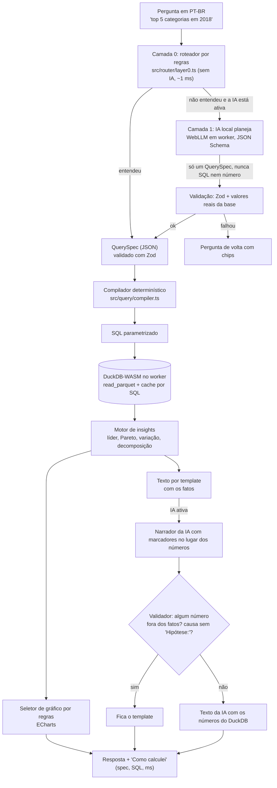
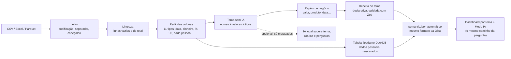
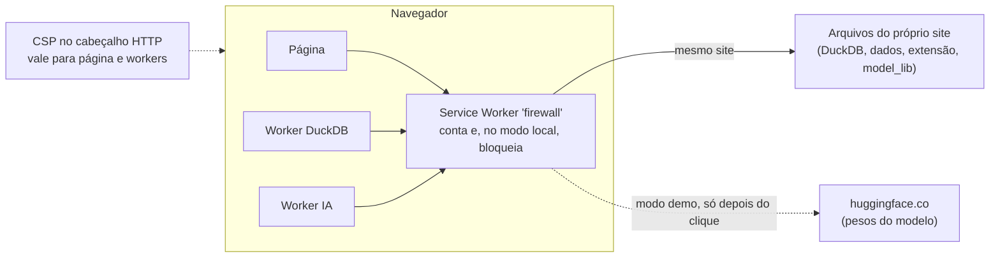

# Arquitetura

Tudo roda **no navegador**. Não existe servidor de aplicação: o site é estático (Vercel) e o cálculo acontece
em dois workers, o DuckDB-WASM (banco de dados) e o WebLLM (IA local, só se você ativar).

## O caminho de uma pergunta

**Por que assim:** o modelo de linguagem é bom para entender a pergunta e ruim para fazer conta. Então ele nunca
calcula (P1) nem escreve SQL (P2): ele só preenche um formulário (QuerySpec) que o Zod valida. Quem calcula é o
DuckDB, com SQL gerado por um compilador testado. O texto da IA usa marcadores; os números vêm do banco, e um
validador recusa qualquer número que não esteja nos fatos.

## Modo Universal: qualquer planilha

A tela **"Entendi assim"** mostra tudo o que foi deduzido (tipo, papel, tema, confiança, porquê) e deixa corrigir.
A configuração vira um "modelo" (impressão digital do layout): a próxima planilha igual abre direto.

## Privacidade em camadas

- **CSP** (cabeçalho HTTP): modo local = nenhum domínio externo; modo demo = só os domínios dos pesos.
- **Service Worker** assume a página ANTES de o DuckDB nascer; conta cada requisição externa (contador ao vivo).
- **Dados sensíveis:** `min_group_size` no compilador esconde grupos com menos de 5 registros em tudo (KPI,
  gráfico, IA, filtro). Detalhes e evidências em [`PRIVACIDADE.md`](PRIVACIDADE.md).

## Onde está cada coisa

| Pasta | O quê |
|---|---|
| `scripts/` | preparo dos dados (Python), download conferido por SHA-256 (extensão, `model_lib`, CSVs), GIF, `vercel.json` |
| `public/data/` | `fato_itens.parquet` (a base da Olist, 1,77 MB) e metadados |
| `src/semantic/` | `semantic.json` (métricas e dimensões com sinônimos) + schema Zod |
| `src/query/` | QuerySpec, compilador, parser de tempo, resolvedor de valores |
| `src/router/` | Camada 0 (regras) |
| `src/ai/` | Camada 1: WebLLM em worker, planejador, narrador, validador, motor falso dos testes, tema pela IA |
| `src/insights/`, `src/charts/`, `src/narrator/` | fatos, escolha do gráfico, texto por template |
| `src/universal/` | Modo Universal: leitura, limpeza, perfil, semântica automática, temas e receitas |
| `src/privacidade/`, `public/sw.js` | firewall, contador, apagar dados locais |
| `src/avaliacao/`, `evals/` | suíte de perguntas, planilhas de teste, resultados |
| `tests/` | Vitest (unitários, no mesmo DuckDB-WASM), Playwright (e2e no build de produção), pytest (dados) |

Decisões com contexto e alternativas descartadas: [`DECISOES.md`](DECISOES.md). Números: [`BENCHMARK.md`](BENCHMARK.md).
